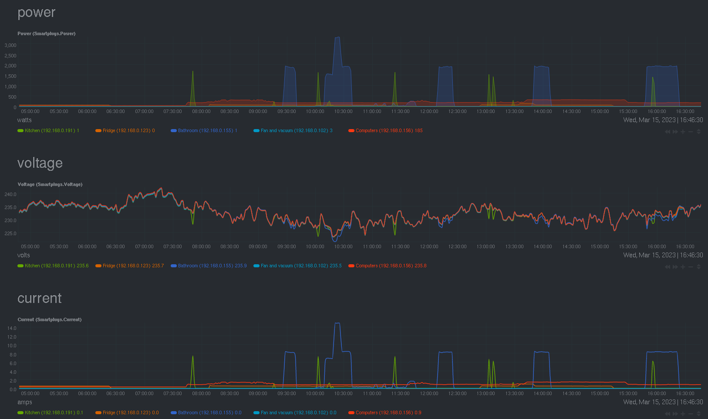

# netdata-hs110-plugin

A [Netdata](https://github.com/netdata/netdata) plugin to monitor readings of [TP-Link HS110 SmartPlugs](https://www.tp-link.com/en/home-networking/smart-plug/hs110/)



# Build and install
```
cargo xtask build
```

Then place the resulting binary (`hs110.plugin`) into Netdata's `custom-plugins.d` directory.
Which is usually `/etc/netdata/custom-plugins.d` or `/usr/local/etc/netdata/custom-plugins.d`

Then create a `/etc/netdata/hs110.conf` (or `/usr/local/etc/netdata/hs110.conf` correspondingly) file specifying addresses of SmartPlugs, like in the example below:
```
hosts:
    - 192.168.0.124
    - 192.168.0.156
    - 192.168.0.155
```

Then after restart of Netdata service you should see a `Smartplugs` section appeared in Netdata web interface.
